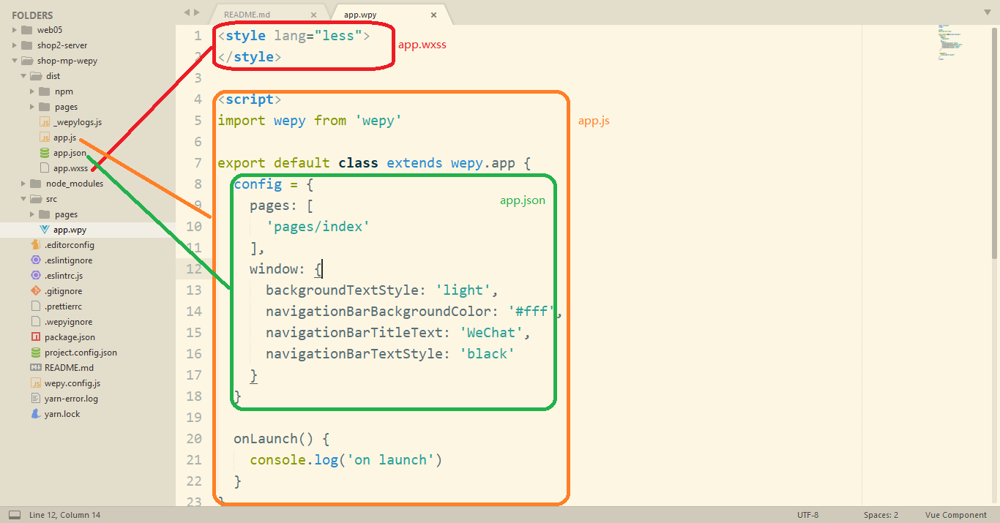

# 品优购项目

## yarn

---

## 使用 WePY

```bash
# 全局安装 WePY
npm i -g wepy-cli

# 查看使用帮助
wepy --help

# 查看可用模板
wepy list

# 基于 empty 模板初始化项目
wepy init empty shop

# 安装依赖
cd shop
npm install

# 启动开发模式
npm run dev
```

最后在小程序开发者工具中加载项目进行预览和调试（直接加载项目根目录即可，不需要 dist 目录）。

## wpy 文件




---

## 项目移植

### 移植配置项

- 把 `images`、`upload` 拷贝到 WePY 项目的 `src` 目录中
- 把 `app.json` 配置拷贝到 `app.wpy` 文件中的 `config` 对象中
  + 分别在 `src/pages` 目录中增加 `home.wpy`、`category.wpy`、`me.wpy`、`cart.wpy` 四个页面文件
  + 修改 pages 页面路径
  + 修改 tabBar 的表填路径对应上 pages 路径
- 保存编译预览

### 移植 home 页面

---

## wepy 对象

---

## 开启 Async 函数支持

> 参考链接：https://github.com/Tencent/wepy/wiki/wepy%E9%A1%B9%E7%9B%AE%E4%B8%AD%E4%BD%BF%E7%94%A8async-await

---

## 首页分类导航

```html
<view class="nav-wrap">
  <view class="nav-item" wx:for="{{ catitems }}" wx:key="image_src">
    <navigator url="{{ item.navigator_url }}" open-type="{{ item.open_type }}">
      <image class="nav-item-img" src="{{ item.image_src }}"></image>
    </navigator>
  </view>
</view>
```

```css
.nav-wrap {
  display: flex;
  padding: 24rpx 0 29rpx 0;
}

.nav-item {
  flex: 1;
  display: flex;
  justify-content: center;
}

.nav-item-img {
  width: 128rpx;
  height: 128rpx;
}
```

---

## 封装请求模块

---

## 封装 API 模块

---

## 首页楼层

```html
<view class='floor'>
  <!-- 首页标题 -->
  <view class='floor-head'>
      <image class='floor-head-img' src='/images/pic_floor01_title@2x.png'></image>
  </view>
  <!-- 楼层主体  -->
  <view class='floor-body'>
    <!-- 主体左侧大图  -->
    <view class='floor-body-left'>
      <navigator class='floor-body-img-link' url=''>
        <image class='floor-body-left-img' src='/images/pic_floor01_1@2x.png'></image>
      </navigator>
    </view>
    <!-- 主体右侧小图  -->
    <view class='floor-body-right'>
      <navigator class='floor-body-img-link' url=''>
        <image class='floor-body-right-img' src='/images/pic_floor01_2@2x.png'></image>
      </navigator>
      <navigator class='floor-body-img-link' url=''>
        <image class='floor-body-right-img' src='/images/pic_floor01_3@2x.png'></image>
      </navigator>
      <navigator class='floor-body-img-link' url=''>
        <image  class='floor-body-right-img' src='/images/pic_floor01_4@2x.png'></image>
      </navigator>
      <navigator class='floor-body-img-link' url=''>
        <image class='floor-body-right-img' src='/images/pic_floor01_5@2x.png'></image>
      </navigator>
    </view>
  </view>
</view>
```

```css
.floor {
  margin-top: 30rpx;
}
.floor-head-img {
  width: 750rpx;
  height: 59rpx;
}
.floor-body {
  background-color: #fff;
  padding: 20rpx 0 10rpx 16rpx;
  display: flex;
}
.floor-body-right {
  display: flex;
  flex-wrap: wrap;
}
.floor-body-img-link {
  margin: 0 10rpx 10rpx 0;
}
.floor-body-left-img {
  width: 232rpx;
  height: 386rpx;
}
.floor-body-right-img {
  width: 233rpx;
  height: 188rpx;
}
.hvr {
  opacity: 0.7;
}
```

## 返回顶部

```html
<view class="to-top">
  <image class="to-top-img" src="/images/arrow_top@2x.png"></image>
  <text class="to-top-txt">顶部</text>
</view>
```

```less
.to-top {
  width: 88rpx;
  height: 88rpx;
  background-color: rgba(255, 255, 255, 0.5);
  border-radius: 50%;
  display: flex;
  flex-direction: column;
  justify-content: center;
  align-items: center;
  position: fixed;
  right: 16rpx;
  bottom: 90rpx;
  &-img {
    width: 24rpx;
    height: 14rpx;
  }
  &-txt {
    color: #666;
  }
}
```

---

## 首页底线

```html
<view class="end-tips">
  <view class="iconfont icon-xiao"></view>
  <text class="end-tips-txt">我是有底线的</text>
</view>
```

```css
.end-tips{
  height: 200rpx;
  display: flex;
  justify-content: center;
  color:#999;
  margin-top: 20rpx;
  &-txt{
    margin-left: 10rpx;
  }
}
```

### 导入字体图标 `style/iconfont.wxss`

```css

@font-face {font-family: "iconfont";
  src: url('//at.alicdn.com/t/font_614011_dnejexuhhhtr19k9.eot?t=1522819240352'); /* IE9*/
  src: url('//at.alicdn.com/t/font_614011_dnejexuhhhtr19k9.eot?t=1522819240352#iefix') format('embedded-opentype'), /* IE6-IE8 */
  url('data:application/x-font-woff;charset=utf-8;base64,d09GRgABAAAAABCwAAsAAAAAGaAAAQAAAAAAAAAAAAAAAAAAAAAAAAAAAABHU1VCAAABCAAAADMAAABCsP6z7U9TLzIAAAE8AAAARAAAAFZW7kgPY21hcAAAAYAAAADYAAACuiejCANnbHlmAAACWAAAC5UAABDkROCbWWhlYWQAAA3wAAAALwAAADYQ9EdVaGhlYQAADiAAAAAcAAAAJAfeA5pobXR4AAAOPAAAABQAAABkY+kAAGxvY2EAAA5QAAAANAAAADQxtjYMbWF4cAAADoQAAAAfAAAAIAErAJpuYW1lAAAOpAAAAUUAAAJtPlT+fXBvc3QAAA/sAAAAwgAAASIiQTneeJxjYGRgYOBikGPQYWB0cfMJYeBgYGGAAJAMY05meiJQDMoDyrGAaQ4gZoOIAgCKIwNPAHicY2Bk/s84gYGVgYOpk+kMAwNDP4RmfM1gxMjBwMDEwMrMgBUEpLmmMDgwVDyTY27438AQw9zA0AAUZgTJAQAn2wyReJzF0dtxgzAQheFfNibYxvcLJL5UkIeUk1IoIE8pdNtw9nD8kgqsmQ+NBNqjYYEZME2fqYLyS0HjJ3fLuD9lMe5XfOe6zrkwYYj745HrIZpxzk/yXT3OkzxTZeWaNxrmeX5Jy4kzPSvWbNiyY8+BI10eqHnZKK+L/j9aPcrXc9Wn4SmvGI3lnyXmpq7FwtS5WJo6Gq2pH7Gy7AWxNlRvY6je1tTp2BmqtzfdLg6WfSSOlh0lTqY7x9lQZmcoszeU+W4o88NQ5sVQ5tVQ5s1Q5t3o/gA/djnIeJx9F1tsHNV1zh3Pzu7s7MzOzmvfT3s3ttdr7+54N4q99jokayeAoXGTpiF2YhJCEM6jaXikoVCaJqA2LwlaFDcCSiEthCJEAbVpQhyligqC8IUqRagSLT+0TSuhqkCl3fTcGTsPtbCaPefMvefec+95D8MxzJWP2NNskFGZRUyRWcbczjDg6oa0RGKQylkF0g16itNNTWJzmVyKz6QLbA3MtEszShUra7p4lwwSxKGcKlVyBZKDfmuIDEDJiAGEIuGJQEc0wB4FIZiL72+tJM+BnshE5aGe1or8sFZKqu4HxEAgFAgcdLs4zk1ImyzBNtPwcB7B1Xqek8P66UQnSYAYyoVv+aYvGQlMP25tj3WYHoDvfQ/USFL6xbASVvB5KGyogRDv97mDYV+mXYMHPvYGVTGW/QuDP4J3nWPn2DoTZNrxliUzDqah8RLwrnSuALmsVR2CaqWKAziDZAEI0xgZ2hDB38bayMH60MZwNBreOFRvvNXkuOZbNiSXIpENQ85sJEJnD9Xpmi0LDAipfBbln2WPsiNMlKkwa/EEKEjRXJlUOtuvFCDt4hWUm0LB+NZRqlTjYIMyjtDzpSSQUdEsvqbikMDl6WzOXmdTVjbt0m2KHfUpIArNDwURUC0Ave2kvb0XQGm+ma3rxvAtw4Zez46sIaarlm9e7q65TLKmjY1oRFUjrEmsWy1wVlrjFgSQQExgPSi+1nttbncblH0K0u8mOgE6E2D5FD0ZiSTpn0wMXequAlS7Lw1NwGYtCBDUPsj0FdvpkvbiAu7LoE5cqJN32GfZFBNB7ysxw0ydWcEwHekCVKodQ9CPNqD6sSr0yiavuXgzRW+YKYBVGUBtmGqqZGguLqOhtobAQn1IwGWo6qhCoCgqrOwjoIsa+L2tnVQ4HO0og97ZXWueFhVYcS8dO0Ap0om+2PxHzR9Lxvw2gFYN0lYmY6X/Lgc1MtoWE97z+m3VlDsupgc8Z2WRfN3WlSQ2TyKeUaKKEk1R4A/ThWm8J2f73jH0vW6mytzEfI2ZxMEUGlVBa5bpDbrRnrqiGdQB+hUrizGYnb+iIgGbohemSkAV2Aop2/emisjRLZBNgpwEuAH6i4Uqijd/by0HWG7tknVd3qVFoxoZpNB5t+dOtH7p13U/rKXwOnryTHEEYKR4po+iywHTDJxRTFOpQ8MiNVyqJ3WIaM3zegQgopOaFqUjy63measBpzHGdaDgLI7SiZ+SetHZsVifxexhgg0YsAPjNbKfakitesCE8TG4B7Y1WreSSqN1FB4cbQ0zN/J18B7IAfvaWOup1hMN+PU7DfhW67ExmLP5rlxk29gS5eNyHkBHXNmAna3HR+FcaWHn63OBl8k5kbgQ8ipqNd1Lc0LWGqZJoVJKYFZAZcuYDq6Le49HDQuzx4SwJhw7Jmhh4disEFY9s2z9usBvnqTzs7N0HuE12skHc+xv8QxuRqFeD9R61G05B6VdHQVqUgzvGLUrntA+JBoXY96xe7+DbOvHwE4Y/VaW3IfGSptm6xMK0ybxJS4eOXIxEU6nw+Hnd3ty4VQ+nzIywtR+0wnQyMv33/9yBOne0V5Iw+vgLFzk7LPjsZMse/Ixd3dsLNbt3v2zYBCTe35pHgxF+8GkNxscC2a9Ow4ScnAHfcn09WWQkVmwB+fYAzBl80DebLSOwJ6xVp0tLVjQtsdZ2x7fYDYhJ96hF7K5agVRAbOejTAisNa4+FzWLjkJsBFVTQIMk3chisMw2AgLUGUYc4hpIBqCXrBRh+GyE30FFcnOyeIW3tPDcZ68EBI3q1qW06UhSeeymrZJDAl5D8f1ePgtomwz5l1XGXNtX8LY+kCcmeipe3wUwvSXb7YgdZOqz0tty2nqZofRlf9fRud4N0/M+Dz1nokZUajP1xOqMx8TYjrm68l8BSmAkyJpYtBc1euyh+3DEDXgkO2j/35Gj0R0Cv7TWkVJeAWh7cOtbxtRcLz45xDppJHeGZm7Sl2rqefYFZi7p2lNrdDEVaXOK6OesUtIQIb2CmZZX8DUuav9dpLqhn41K7FxYhq0yFUKQGtZrsAOsdTVc1mJWtOooJeTR2VVlQdvErSI964tQkQXltUkTZO2bbOhGlNhhnLMrF77yuzWrsjU4bWWtef9Yd4dCvNLP3745gdvN9vX7nvi5u0/MS0x4ufEnUo7dwoOazF1Gd1uyxZBjwjL6Ea9FEzR3aYAyV54Qcf9Xv3V7FbdB/fPiBGJ9+3YFAvgdj/GbQPRp7dleC4Yca/0atrxT5xaj+Bx8hCjMTEmizkL3Q4ziaHbIWpTEtgVnNLcAkGY0SkSbMcwbPQCYjLV+hQqq6rVVRVyOyBEej9sHFODQZVGGcVjG+GJzsWLJ6rVLgddlX+BPMnoTJLpQcsUWGzpeJcZZ0tDpFrh7LxRMjBtsGlXzE48NbQI+7v05O59P9y3ezItCNfI1sD2M7XamQ8p2O7kBHhyyeTy9vblk0s07Sp1Hu6+44676R+wWqxTHLCQv8+RdcxyfMlVFkxtNzAStmEYvngEDF6bRFi2X3TnXDSOy6WqHcdV+oJ+xr4+lgjyfCzmWXzqw1OLPbEYzweTK0QjIa6Mp2Wl5OYlj1fzLS71G0mjv7RY1AXB53aX/P50fKUYN+FHjUyXFFPc0oaZmQ2SW4lJXZmGGA96R0Oq4F4txTycukHmpvyG4Z/i5A0q54lJq92CGhr1BuO273+EvUsSu8ki3gq7LyzU/EJRT9FYyKSui0ks6pxRqQKNDh5cGvuIpGLxbJ5wiijslwIBqbXXLrl9ZF2xDmprUggL8IhHCwmtRwX4nM7Pl9x1iNWIiqzNE84SusERATzwiBDSPMgfpv0V6n2O9WONGWDuwBj9DrMPz7pQYPj/G7C0Dg2AE7CIHRuUHdb+jgxGI03HPEctePV2NKLtclTBkM3A9ZpADj3jlNhydaFhIR9oCQ2fz31+v6+zzxMwPeO3ecyAp69TVBRxYsKGSkiZoAwTcEWG4V7iHsy1mLY2rAdQL5I1eHHZTAAkPvMZLHwK05Awmy/RkXiQrEE8OjoFMDU62jjcM0jIYM9h2ClrWlzTvLhzkYobH6eii+APKUkcG6Nix5BIPpfurbNyZ8E1DUQY6GytR4Ogliso4k9m8hRRZVfzr7ZwE553cJpMjjam8Oun1lMYpD7vdvRPLuPXlcXUmAlmPbOL+S5ziEYBrWiojIxT5A2TarJs5wcHFqlCrWyHXdydeq/SPE77PqpGNF8mXcMoQT4rRzvAa9O0n3T2Vcolc173/Rm7ky6bht5RGmZtB9Bp4LHHa/Ii8zj0Zh6MThTX7CIQhVRI8zbubHjP2TDZBYHmemzoYWLIhncm8/mRfP6fh4XR6VFBZ8tLcZm4TpThDWdmt5cHb6OYXyYdV335JQCD+dWraYHp0szmmNczyIE/KEPJrcAfbwtoeJ/2LiC71izpbTVDKSgsWVKgf+hKvhjt/9eCWITNp6B7aTc+W+k8+UM7XdWeBFlsMfMze93eAkosLYJVEhnI9wzA4mhXBEKJ7KR7UNwt+v3ippLbUOb7kwtsAb8/GM5u+7K06asME2z7SBxbD9PgXaTpdl++rLeDekKSjC8O+PK+A18YPukFFQLeHnZ62h02r5wPdLlql1T1Us3VFTh/xfS5nfq4sH/xqyR0YJOZsycoBx2TMSq/Um7rMzc/J4Nw4G2/Z9s2j//tAwLIc/yXH+c37Pj7ft/TxTbp1VeltuLTPv/746zTo53FGj7CFLBO5SqEflNKRIsTmnEL9MA4gh/1WC2MgExoirAT8Bv7t/ruq82+PLunXt87++Iq2SvG5LveHS9Z1uaHDz1c2kzuJMTrfYbm2gPfh/rewXp9D7LvHU7z0bjo6lp0Swn5NltW6Z7W3+4lRIyLz3jNOHNjfx64sT9n+VzVrJo3tOLPDr40uP3C4I2d959xcMeFgf8CKjAH/wAAAHicY2BkYGAA4pA/rxfF89t8ZeBmYQCBa68aVyDo//tZGJg9gVwOBiaQKABw7gx4AHicY2BkYGBu+N/AEMPCAAJAkpEBFUgCAEcfAoJ4nGNhYGBgfsnAwMJAOwwAassBTQAAAAAAdgC2AUABtAJAAlQCaAJ8Ar4DMANEA94EIASsBOwFNAWeBfAGsAeAB7AIAghMCHJ4nGNgZGBgkGToY+BgAAEmIOYCQgaG/2A+AwAZgwHGAHicZY9NTsMwEIVf+gekEqqoYIfkBWIBKP0Rq25YVGr3XXTfpk6bKokjx63UA3AejsAJOALcgDvwSCebNpbH37x5Y08A3OAHHo7fLfeRPVwyO3INF7gXrlN/EG6QX4SbaONVuEX9TdjHM6bCbXRheYPXuGL2hHdhDx18CNdwjU/hOvUv4Qb5W7iJO/wKt9Dx6sI+5l5XuI1HL/bHVi+cXqnlQcWhySKTOb+CmV7vkoWt0uqca1vEJlODoF9JU51pW91T7NdD5yIVWZOqCas6SYzKrdnq0AUb5/JRrxeJHoQm5Vhj/rbGAo5xBYUlDowxQhhkiMro6DtVZvSvsUPCXntWPc3ndFsU1P9zhQEC9M9cU7qy0nk6T4E9XxtSdXQrbsuelDSRXs1JErJCXta2VELqATZlV44RelzRiT8oZ0j/AAlabsgAAAB4nG2OaY7CMAyF86CkCzAr+x04VKZNG0MVjxQsSk9PCvQfT7Jsf7blpybqqUK91x4TTJFgBo0UGXIUmGOBJT7wiS984we/WGGNDbbYYY+DQqc7Mb63uiLj/yVrWK5SOptW5JvK+OIU+YWlI7N4lcEZ34z8xpIOoHSSnG0tI++FdXC2d6TjKXeUXoTO8VUytFN7s3mMY9lysPov3pworwzVMuwUsQqOxQkvh1zGh8ea2jYbOx2iD+H50/xjptQdA5hNQgAA') format('woff'),
  url('//at.alicdn.com/t/font_614011_dnejexuhhhtr19k9.ttf?t=1522819240352') format('truetype'), /* chrome, firefox, opera, Safari, Android, iOS 4.2+*/
  url('//at.alicdn.com/t/font_614011_dnejexuhhhtr19k9.svg?t=1522819240352#iconfont') format('svg'); /* iOS 4.1- */
}

.iconfont {
  font-family:"iconfont" !important;
  font-size:16px;
  font-style:normal;
  -webkit-font-smoothing: antialiased;
  -moz-osx-font-smoothing: grayscale;
}

.icon-xuanze:before { content: "\e608"; }

.icon-dianpu:before { content: "\e609"; }

.icon-gouwuche:before { content: "\e60a"; }

.icon-dingdan:before { content: "\e60b"; }

.icon-jiantouxia:before { content: "\e60c"; }

.icon-jiantoushang:before { content: "\e60d"; }

.icon-jiantouyou:before { content: "\e60e"; }

.icon-shanchu:before { content: "\e60f"; }

.icon-kefu:before { content: "\e610"; }

.icon-jiantouzuo:before { content: "\e611"; }

.icon-shezhi:before { content: "\e612"; }

.icon-xiaoxi:before { content: "\e616"; }

.icon-tuikuan:before { content: "\e617"; }

.icon-xiao:before { content: "\e618"; }

.icon-eye:before { content: "\e619"; }

.icon-eye-close:before { content: "\e61a"; }

.icon-bianji:before { content: "\e61b"; }

.icon-daifukuan:before { content: "\e61c"; }

.icon-daishouhuo:before { content: "\e61d"; }

.icon-shoucang-fill:before { content: "\e613"; }

.icon-shoucang:before { content: "\e614"; }

.icon-sousuo:before { content: "\e61e"; }

.icon-xuanze-fill:before { content: "\e615"; }
```

---

## 详情页

```html
<template>
<view class="fixed-bar">
  <view class="item">
    <button open-type="contact" class="contact-btn"></button>
    <view class="iconfont icon-kefu"></view>
    <text class="item-note">联系客服</text>
  </view>
  <view class="item">
    <view class="iconfont icon-gouwuche"></view>
    <text class="item-note">购物车</text>
  </view>
  <view class="btn-group">
    <view class="btn yellow-button">加入购物车</view>
    <view class="btn red-button">立即购买</view>
  </view>
</view>
<!--
  这里希望直接调用组件，统一风格
  -->
<swiper class="swiper"
  indicator-dots="true"
  indicator-color="rgba(255,255,255,.5)"
  indicator-active-color="#ffffff"
  interval="2500"
  autoplay="true"
  circular="true">
  <swiper-item>
    <image class="swiper-img" src="/upload/detail_banner@2x.png" />
  </swiper-item>
  <swiper-item>
    <image class="swiper-img" src="/upload/detail_banner@2x.png" />
  </swiper-item>
  <swiper-item>
    <image class="swiper-img" src="/upload/detail_banner@2x.png" />
  </swiper-item>
</swiper>
<view class="product-info">
  <view class="product-head">
    <text class="price">￥123</text>
    <text class="old-price">￥688</text>
  </view>
  <view class="product-body">
    <view class="product-name">
      商品名称
    </view>
    <view class="product-like">
      <view class="iconfont icon-shoucang"></view>
      <view>收藏</view>
    </view>
  </view>
  <view class="product-foot">
    快递：<text>免运费</text>
  </view>
</view>
<view class="part">
  <view class="part-item part-line">
    <text class="note">促销</text><text class="description color-main">满300减30元</text>
  </view>
  <view class="part-item">
    <text class="note">已选</text><text class="description">黑色/S/1件</text>
    <view class="iconfont icon-jiantouyou"></view>
  </view>
</view>
<view class="part">
  <view class="part-item">
    <text class="note">送至</text><text class="description">收货地址xxxxxxxxxxxxxxxxxxxxxxxxxxxxxxx</text>
    <view class="iconfont icon-jiantouyou"></view>
  </view>
</view>

<view class="tabs">
  <view class="tabs-head">
    <view class="tabs-item active">
      图文详情
    </view>
    <view class="tabs-item">
      规格参数
    </view>
  </view>
  <view class="tabs-body">
    <view class="tabs-content" hidden="{{ activeTabsIndex != 0 }}">
      商品图文展示
    </view>
    <view class="tabs-content">
      <view class="param-item">
        <text class="note">商品名称</text>
        <text class="description">复古撞色运动外套男女情侣校服立领夹文字自动换行</text>
      </view>
      <view class="param-item">
        <text class="note">品牌</text>
        <text class="description">初语</text>
      </view>
      <view class="param-item">
        <text class="note">编号</text>
        <text class="description">BR1005</text>
      </view>
    </view>
  </view>
</view>
</template>

<script>
import wepy from 'wepy'

export default class Cart extends wepy.page {
  onLoad (options) {
    console.log(options)
  }
}
</script>

<style lang="less">
.swiper,
.swiper-img {
  width: 750rpx;
  height: 720rpx;
}

.product-info {
  height: 300rpx;
  background-color: #fff;
  padding: 0 16rpx;
}
.product-head {
  height: 38rpx;
  padding: 40rpx 0;
}
.product-head .price {
  color: #ff2d4a;
  font-size: 50rpx;
  margin-left: -10rpx;
}
.product-head .old-price {
  color: #999;
  font-size: 26rpx;
}
.product-body {
  display: flex;
  align-items: center;
  justify-content: space-between;
}
.product-body .product-name {
  font-size: 34rpx;
  width: 546rpx;
  height: 88rpx;
  line-height: 1.3;
  /* 多行文字隐藏省略号 */
  overflow: hidden;
  text-overflow: ellipsis;
  display: -webkit-box;
  -webkit-box-orient: vertical;
  -webkit-line-clamp: 2;
}
.product-body .product-like {
  width: 50rpx;
  height: 78rpx;
  border-left: 1rpx solid #ddd;
  padding-left: 46rpx;
  margin-right: 30rpx;
  color: #999;

  display: flex;
  flex-direction: column;
  align-items: center;
  justify-content: space-between;
}
.product-body .product-like .icon-shoucang {
  width: 32rpx;
  height: 32rpx;
  margin-top: 10rpx;
}

.product-foot {
  font-size: 30rpx;
  color: #999;
  margin-top: 34rpx;
}

.part {
  background-color: #fff;
  margin: 20rpx 0;
  font-size: 32rpx;
  color: #999;
}
.part-item {
  display: flex;
  padding: 28rpx 16rpx;
  position: relative;
  align-items: center;
}
.part-line:after {
  content: '';
  height: 1rpx;
  width: 734rpx;
  background-color: #ddd;
  display: block;
  position: absolute;
  bottom: -1rpx;
}
.part-item .note {
  color: #333;
  margin-right: 40rpx;
}
.part-item .description {
  width: 490rpx;
  overflow: hidden;
  text-overflow: ellipsis;
  white-space: nowrap;
  word-wrap: normal;
}
.icon-jiantouyou {
  width: 25rpx;
  height: 25rpx;
  color: #ccc;
  position: absolute;
  right: 46rpx;
  display: flex;
  align-items: center;
  justify-content: center;
}

.tabs-head {
  height: 100rpx;
  background-color: #fff;
  display: flex;
}
.tabs-head .tabs-item {
  flex: 1;
  display: flex;
  align-items: center;
  justify-content: center;
  font-size: 30rpx;
  position: relative;
}
.tabs-head .active {
  color: #ff2d4a;
  font-weight: 400;
}
.tabs-head .active:after {
  content: '';
  height: 12rpx;
  width: 100%;
  background-color: #ff2d4a;
  position: absolute;
  left: 0;
  bottom: 0;
}
.tabs-body {
  padding: 16rpx;
  padding-bottom: 250rpx;
}
.param-item {
  padding: 30rpx 0;
  font-size: 28rpx;
  display: flex;
  align-items: flex-start;
  line-height: 1.3;
}
.param-item .note {
  width: 150rpx;
  color: #999;
}
.param-item .description {
  width: 568rpx;
}

.fixed-bar {
  width: 750rpx;
  height: 98rpx;
  background-color: #fff;
  position: fixed;
  bottom: 0;
  z-index: 11;
  display: flex;
  align-items: center;
  justify-content: space-between;
}
.fixed-bar .item {
  flex: 1;
  display: flex;
  flex-direction: column;
  align-items: center;
  justify-content: center;
}
.fixed-bar .item .iconfont {
  width: 40rpx;
  height: 40rpx;
  font-size: 40rpx;
  color: #999;
}

.fixed-bar .item .item-note {
  margin-top: 10rpx;
  font-size: 22rpx;
  color: #666;
}
.fixed-bar .btn-group {
  display: flex;
}
.fixed-bar .btn {
  width: 213rpx;
  height: 98rpx;
  line-height: 98rpx;
  text-align: center;
  font-size: 30rpx;
  color: #fff;
}
.yellow-button {
  background-color: #ffb400;
}
.red-button {
  background-color: #ff2d4a;
}

.wxParse-content {
  padding: 55rpx;

  .wxParse-a {
    display: none;
  }
}

.fixed-bar .item {
  position: relative;
}
.contact-btn {
  background-color: pink;
  width: 100%;
  height: 100%;
  position: absolute;
  left: 0;
  bottom: 0;
  opacity: 0;
}
</style>

```

## 商品详情

- 页面传参
- 发起请求
- 商品详情轮播图
- 图片预览
  + wx.previewImage
- 选择收货地址
  + API => 开放接口 -> 收货地址
- 调试编译模式
- 本地数据缓存收货地址
- 商品规格参数
- tab 栏切换
- 编程式导航
- 商品详情
- webp 格式图片
- 购物车页面
- 点击添加购物车
  + 采集特定数据
  + 购物车数据存储到本地缓存
  + 如果没有则添加，如果有，则让其 count + 1
- 界面交互
- 展示购物车列表数据
- 删除购物车数据
- 空购物车状态
- 购物车商品数量修改

## 购物车页面

```html
<template>
  <!-- 收货地址 -->
  <view class="chooseAddress-component">
    <view class="address-info">
      <view class="item space-between">
        <view class="col">
          <text class="note">收货人：</text>
          <text class="detail">张三</text>
        </view>
        <view class="col">
          <text class="address-phone">123456789</text>
          <view class="iconfont-tap icon-jiantouyou"></view>
        </view>
      </view>
      <view class="item">
        <text class="note">收货地址：</text>
        <text class="detail">xxxxxxxxxxxxxxxx</text>
      </view>
      <!-- <view class="add-address-btn">+ 新增地址</view> -->
      <image class="address-border" src="/images/cart_border@2x.png" alt="" />
    </view>
  </view>
  <view class="divider"></view>
  <view class="cart-list">
    <view class="shop-head">
      <!-- <view class="iconfont-tap icon-xuanze icon-xuanze-fill"></view> -->
      <view class="shop-head-info">
        <view class="iconfont icon-shop flex-center icon-dianpu"></view>
        <text class="shop-name">优购生活馆</text>
      </view>
      <!-- <view class="iconfont-tap icon-bianji"></view> -->
    </view>
    <view class="product-item">
      <!-- icon-xuanze-fill 选择状态 -->
      <view class="iconfont-tap icon-xuanze icon-xuanze-fill"></view>
      <navigator url="/pages/goods_detail?goods_id=55578" class="product-left">
        <image class="product-img" src="http://image4.suning.cn/uimg/b2c/newcatentries/0070141413-000000000623824255_1_400x400.jpg" />
      </navigator>
      <view class="product-right">
        <navigator url="/pages/goods_detail?goods_id=55578" class="product-name">
          小米电视xxxx
        </navigator>
        <view class="product-detail">
          <!-- 商品简介 -->
        </view>
        <view class="product-price">
          <text class="product-price-symbol">￥</text>
          <text class="product-price-integer">998</text>
          <text class="product-price-decimal">.00</text>
        </view>
        <!-- <view class="product-count">x{{ item.counts }}</view> -->
        <view class="product-count-eidt">
          <!-- disabled 禁用状态 -->
          <view class="count-min disabled">-</view>
          <input class="count-number" type="number" value="{{ 10 }}" />
          <view class="count-add">+</view>
        </view>
      </view>
    </view>
  </view>
  <view class="bottom-space"></view>
  <view class="fixed-bar">
    <view class="iconfont-tap icon-xuanze icon-xuanze-fill"></view>
    <text class="select-all">全选</text>
    <view class="total">
      <view class="total">
        <view class="total-body">
          <view class="total-note">合计：</view>
          <view class="product-price">
            <text class="product-price-symbol">￥</text>
            <text class="product-price-integer">99998</text>
            <text class="product-price-decimal">.00</text>
          </view>
        </view>
        <view class="total-foot">包含运费</view>
      </view>
    </view>
    <!-- <button @tap="">查询订单</button> -->
    <view class="buy-button">
      <!-- <BtnWxLogin></BtnWxLogin> -->
      结算(1561565)
    </view>
  </view>
  <!-- 购物车没有数据的提示信息 -->
  <view class="cart-empty flex-center" hidden="{{ true }}">
    <image class="cart-empty-img" src="/images/cart_empty@2x.png"></image>
    <view class="cart-empty-txt">你还没有添加任何商品</view>
  </view>
</template>
<script>
import wepy from 'wepy'

export default class Cart extends wepy.page {}
</script>

<style lang="less">
.address-info {
  height: 222rpx;
  position: relative;
  background-color: #fff;
}

.address-info .item {
  padding: 22rpx 16rpx;
  display: flex;
  flex-wrap: wrap;
  font-size: 32rpx;
  line-height: 1.3;
}

.address-info .item .col {
  display: flex;
  align-items: center;
}

.address-info .item .note {
  width: 160rpx;
}

.address-info .item .detail {
  max-width: 480rpx;
}

.address-info .item .address-phone {
  margin-right: 82rpx;
}

.address-info .item .icon-jiantouyou {
  position: absolute;
  right: 0;
}

.address-info .item .icon-jiantouyou:before {
  font-size: 24rpx;
  color: #999;
  line-height: 1;
  width: 15rpx;
  height: 25rpx;
}

.address-border {
  width: 100%;
  height: 15rpx;
  position: absolute;
  bottom: 0;
}

.add-address-btn {
  width: 360rpx;
  height: 80rpx;
  background-color: #f4f4f4;
  border-radius: 5rpx;
  color: #ccc;
  font-size: 32rpx;
  display: flex;
  justify-content: center;
  align-items: center;
  position: absolute;
  left: 50%;
  top: 50%;
  transform: translate(-50%, -50%);
}

.cart-list {
  background-color: #fff;
}

.shop-head {
  height: 88rpx;
  display: flex;
  align-items: center;
  border-bottom: 1rpx solid #ddd;
  position: relative;
  padding: 0 88rpx;
  // 屏蔽店铺全选后，把左内边距减少
  padding-left: 30rpx;
}

.shop-head-info {
  display: flex;
  font-size: 32rpx;
  align-items: center;
}

.shop-head-info .shop-name {
  margin-left: 10rpx;
}

.icon-xuanze,
.icon-xuanze-fill {
  position: absolute;
  left: 0;
}

.icon-xuanze:before,
.icon-xuanze-fill:before {
  width: 32rpx;
  height: 32rpx;
}

.icon-xuanze {
  color: #ccc;
}

.icon-xuanze-fill {
  color: #ff2d4a;
}

.icon-dianpu {
  color: #999;
}

.shop-head .icon-bianji {
  position: absolute;
  right: 0;
}

.shop-head .icon-bianji:before {
  width: 32rpx;
  height: 32rpx;
  color: #999;
}

.product-item {
  display: flex;
  padding: 30rpx 20rpx 30rpx 0;
  margin-left: 20rpx;
  border-top: 1rpx solid #ddd;
  margin-top: -1rpx;
  align-items: center;
  position: relative;
}

.product-left {
  width: 200rpx;
  height: 200rpx;
  background-color: #eee;
  margin-right: 26rpx;
}

.product-left .product-img {
  width: 200rpx;
  height: 200rpx;
}

.product-right {
  width: 480rpx;
  display: flex;
  flex-direction: column;
  justify-content: space-between;
  position: relative;
}

.product-name {
  height: 84rpx;
  font-size: 30rpx;
  line-height: 1.4;
  /* 多行文字隐藏省略号 */
  overflow: hidden;
  text-overflow: ellipsis;
  display: -webkit-box;
  -webkit-box-orient: vertical;
  -webkit-line-clamp: 2;
}

.product-price {
  color: #ff2d4a;
}

.product-price-symbol,
.product-price-decimal {
  font-size: 28rpx;
}

.product-price-integer {
  font-size: 44rpx;
}

.cart-list .product-item {
  display: flex;
  padding: 20rpx 16rpx 20rpx 0;
  border-top: 1rpx solid #ddd;
  margin-top: -1rpx;
  margin-left: 88rpx;
}

.product-left {
  margin-right: 20rpx;
}

.product-left,
.product-left .product-img {
  width: 160rpx;
  height: 160rpx;
}

.product-right {
  width: 464rpx;
}

.product-price-symbol,
.product-price-decimal {
  font-size: 24rpx;
}

.product-price-integer {
  font-size: 34rpx;
}

.product-item .icon-xuanze,
.product-item .icon-xuanze-fill {
  left: -88rpx;
}

.product-detail {
  font-size: 24rpx;
  line-height: 1.25;
  color: #999;
  margin: 20rpx 0 30rpx;
}

.product-count {
  position: absolute;
  right: 0;
  bottom: 0;
  letter-spacing: 2rpx;
}

.fixed-bar {
  width: 750rpx;
  height: 98rpx;
  padding: 18rpx 250rpx 18rpx 88rpx;
  box-sizing: border-box;
  background-color: #fff;
  position: fixed;
  bottom: 0;
  z-index: 11;
  display: flex;
  align-items: center;
  justify-content: space-between;
  .icon-xuanze {
    padding-right: 60rpx;
  }
}

.buy-button {
  width: 230rpx;
  height: 98rpx;
  line-height: 98rpx;
  font-size: 30rpx;
  background-color: #ff2d4a;
  color: #fff;
  position: absolute;
  right: 0;
  text-align: center;
}

.select-all {
  font-size: 30rpx;
}

.total-body {
  display: flex;
  align-items: baseline;
  font-size: 30rpx;
}

.total-foot {
  margin-top: 10rpx;
  color: #999;
}

.cart-empty {
  flex-direction: column;
  padding: 100rpx 0;
  &-img {
    width: 180rpx;
    height: 180rpx;
    margin-bottom: 50rpx;
  }
  &-txt {
    font-size: 28rpx;
  }
  .login-btn {
    margin-top: 30rpx;
    // background-color: #ff2d4a;
    border: 1rpx solid #ff2d4a;
    color: #ff2d4a;
    height: 60rpx;
    line-height: 60rpx;
    font-size: 24rpx;
  }
}

.product-count-eidt {
  display: flex;
  position: absolute;
  right: 0;
  bottom: 0;
  .count-min,
  .count-add {
    width: 60rpx;
    height: 50rpx;
    box-sizing: border-box;
    border: 4rpx solid #666;
    line-height: 50rpx;
    font-size: 28rpx;
    display: flex;
    align-items: center;
    justify-content: center;
    &.disabled {
      border-color: #ccc;
      color: #ccc;
    }
  }
  .count-min {
    border-radius: 5rpx 0 0 5rpx;
  }
  .count-add {
    border-radius: 0 5rpx 5rpx 0;
  }
  .count-number {
    height: 50rpx;
    line-height: 50rpx;
    width: 80rpx;
    text-align: center;
  }
}

.wx-login-btn {
  width: 230rpx;
  height: 98rpx;
}
</style>

```

